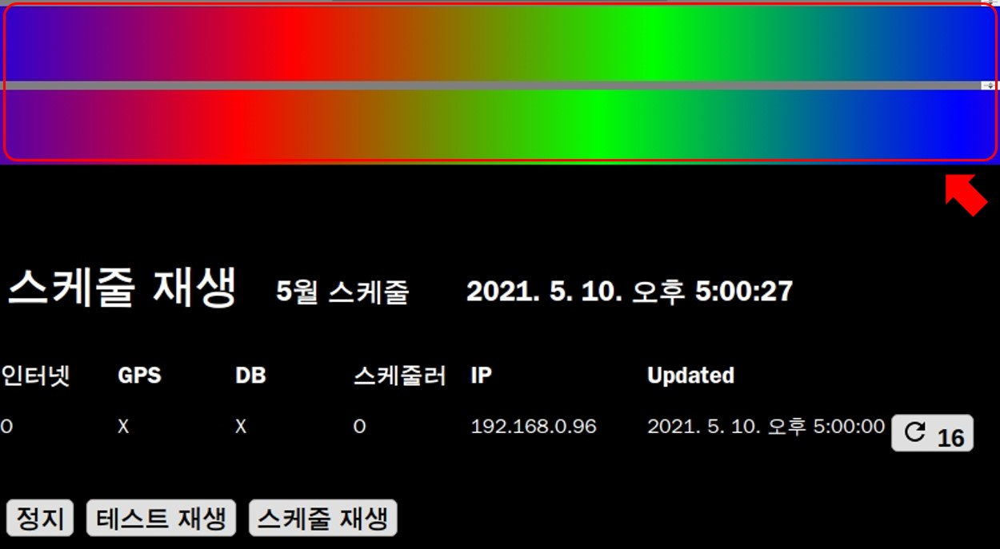
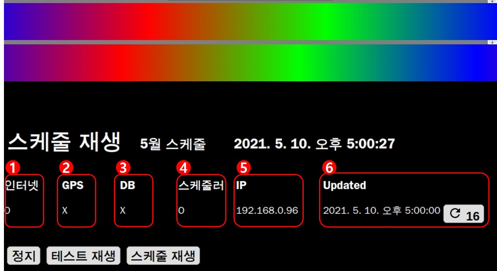
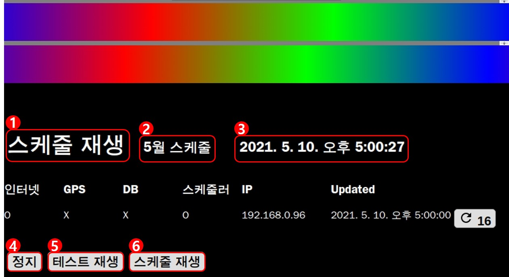

# 제어창
제어창은 **1. 재생 화면**, **2. 현재 상태**, **3. 제어탭** 으로 구성되어 있습니다.

## 1. 재생 화면
현재 재생 중인 시나리오가 표시됩니다. 재생화면은 구역 순서에 맞게 재생됩니다.

## 2. 현재 상태

### 1. 현재 인터넷 연결 상태

### 2. 현재 GPS 연결 상태

### 3. 현재 DB 연결 상태

### 4. 현재 스케줄러 연결 상태

### 5. 현재 IP

### 6. 최종 업데이트된 시간
새로 고침까지 남은 시간이 표시되고 버튼을 누르면 즉시 새로 고침됩니다.

## 3. 제어탭

### 1. 재생 중인 타입
지금 재생 중인 상태의 타입 **테스트 재생**, **스케줄 단독 재생**, **스케줄 재생**, **정지**가 표시됩니다.
현재는 `스케줄 재생` 버튼을 누른 상태이므로 스케줄 재생이 표시되고 있습니다.

### 2. 이름
재생 중인 스케줄의 이름이 표시됩니다. 재생시간이 동일한 스케줄이 2개 이상 실행될 땐 첫 번째 스케줄 이름만 표시됩니다.

### 3. 시간
현재 시간이 표시됩니다.

### 4. 정지
현재 재생 중인 상태를 정지시킵니다.

### 5. 테스트 재생
테스트 재생을 실행시킵니다.

### 6. 스케줄 재생
현재 시간에 맞는 스케줄을 실행시킵니다.
