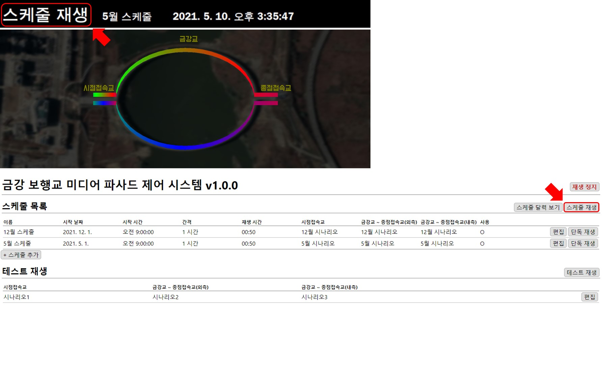

# MFPlayer 재생

## 재생 상태 확인
현재 재생 상태는 홈 화면과 MMBA 화면에서 확인할 수 있습니다.

### 홈
**1. 동작 상태** 와 **2. 가상 재생 화면**이 표시됩니다.

### MMBA
**1. 재생 중인 시나리오** 와 **2. 동작 상태**가 표시됩니다. MMBA 제어창의 자세한 설명은 [제어창](../control/README.md)에서 설명하겠습니다.

## 재생 하기

### 테스트 재생
테스트 재생은 시나리오만 추가해 별도의 스케줄 시간을 지정하지 않고 시나리오만 **단독**으로 재생합니다. 테스트 재생은 기본적으로 생성되어 있고 시나리오는 수정할 수 있습니다. 테스트 재생 수정 방법은 [테스트 재생](../testPlay/README.md)에서 설명하겠습니다.

홈 화면에서 `테스트 재생` 버튼을 누르면 테스트 재생의 시나리오가 재생됩니다.

MMBA 화면에서도 확인과 재생이 가능합니다.

### 스케줄 단독 재생
테스트 재생과 다르게 스케줄 시간을 가지고 있지만 단독 재생 시 시간과 관계없이 시나리오만 **단독**으로 재생합니다.

**21년 12월**부터 재생되는 스케줄이 있습니다. 현재는 **21년 5월**이므로 재생되지 않는 스케줄이지만 `단독 재생`버튼을 누르면 시간과 관계없이 재생할 수 있습니다.

MMBA 화면에서도 확인할 수 있습니다.

### 스케줄 재생
시나리오가 스케줄에 맞게 재생됩니다. 현재는 **21년 5월**이므로 여러 스케줄 중 현재 시간과 일치하는 **5월 스케줄**이 재생됩니다.

MMBA 화면에서도 확인과 재생이 가능합니다.

