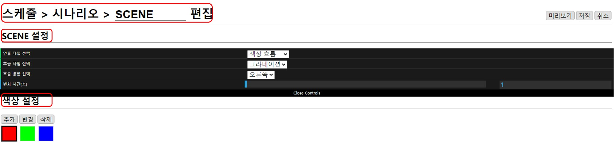
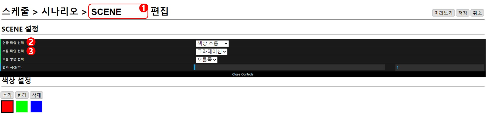
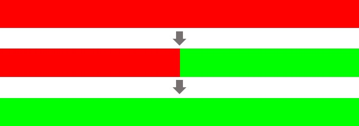
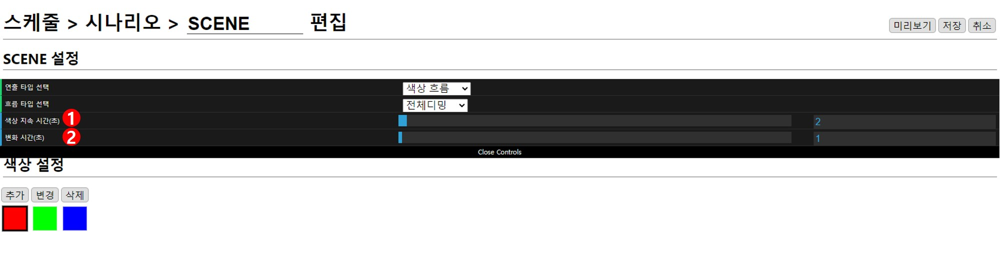
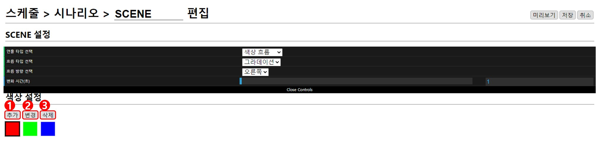
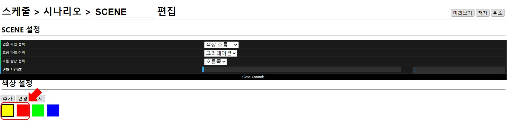

# 색상 흐름
편집창은 **현재 위치**, **SCENE 설정**, **색상 설정**으로 구성되어 있습니다.

## SCENE 설정

### 1. 연출 이름
이름은 랜덤으로 설정되기 때문에(편집 화면에서 수정 가능) 예시 그림의 이름과 다를 수 있습니다.

### 2. 연출 타입 선택
색상 연출을 위해 **색상 흐름**으로 선택합니다.

### 3. 흐름 타입 선택
색상이 흐르는 타입은 **그라데이션**, **전체디밍**, **단색흐름**중 선택할 수 있습니다.

## 그라데이션, 단색흐름

### 1. 흐름 방향

**흐름 타입**에서 방향이 있는 타입을 선택하면 나타납니다. 색상이 흐르는 방향을 **오른쪽**, **왼쪽**, **위**, **아래** 중 선택할 수 있습니다.

### 2. 변화 시간(초)

* 그라데이션 : 색상이 시작 좌표에서 끝나는 좌표까지 이동하는데 걸리는 시간

* 단색 흐름 : 색상이 이동해 다음 색상으로 완전히 변하는데 걸리는 시간

## 전체디밍

### 1. 색상 지속 시간(초)

**흐름 타입**에서 **전체 디밍**을 선택하면 나타납니다. **색상 설정**에 추가되어 있는 색상에 도달하면 설정된 시간만큼 유지됩니다. 
0.1초 단위로 조절 가능하고 최소 0초, 최대 100초로 설정할 수 있습니다.

### 2. 변화 시간(초)

색상이 순서대로 변화할 때 현재 색상에서 다음 색상으로 변화하는 데까지 걸리는 시간을 설정할 수 있습니다.
0.1초 단위로 조절 가능하고 최소 0.1초, 최대 100초로 설정할 수 있습니다.

## 색상 설정

### 1. 추가
새로운 색상은 선택된 색상 앞으로 추가되므로 추가하고 싶은 곳의 바로 뒤 색상을 선택하고 `추가`버튼을 누릅니다.

* 예시:  빨강 선택 →  추가 → 노랑 선택

### 2. 변경
변경하고 싶은 색상을 선택한 뒤 `변경`버튼을 누르고 원하는 색상으로 변경합니다.

### 3. 삭제
선택된 색상이 삭제됩니다.
