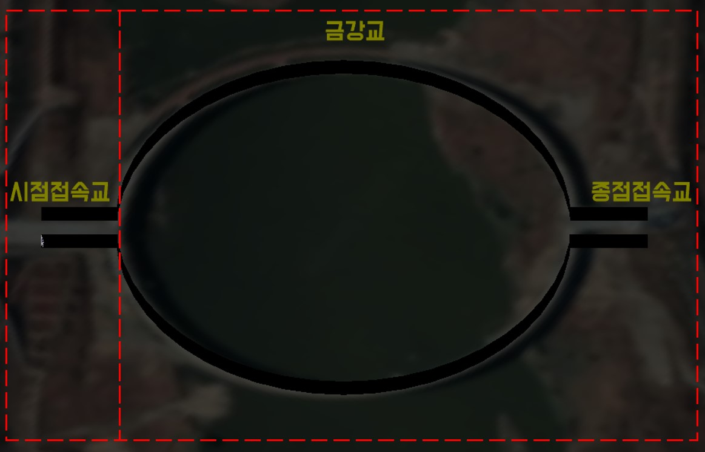
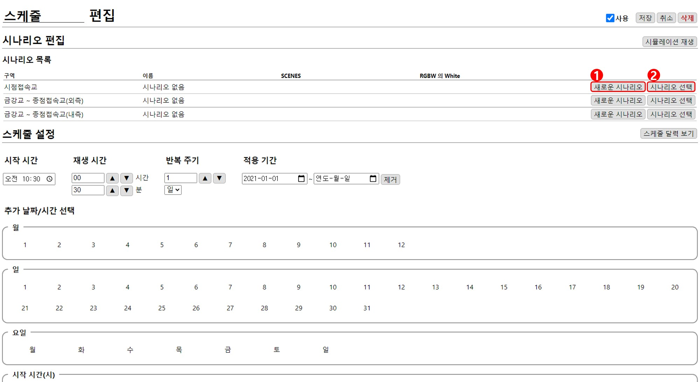
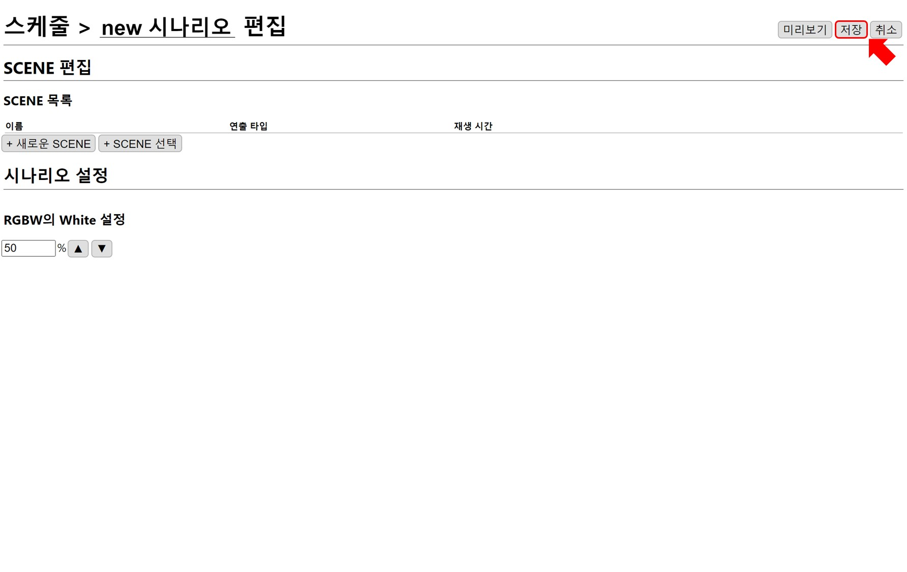
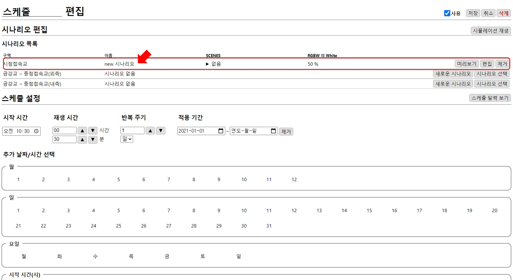
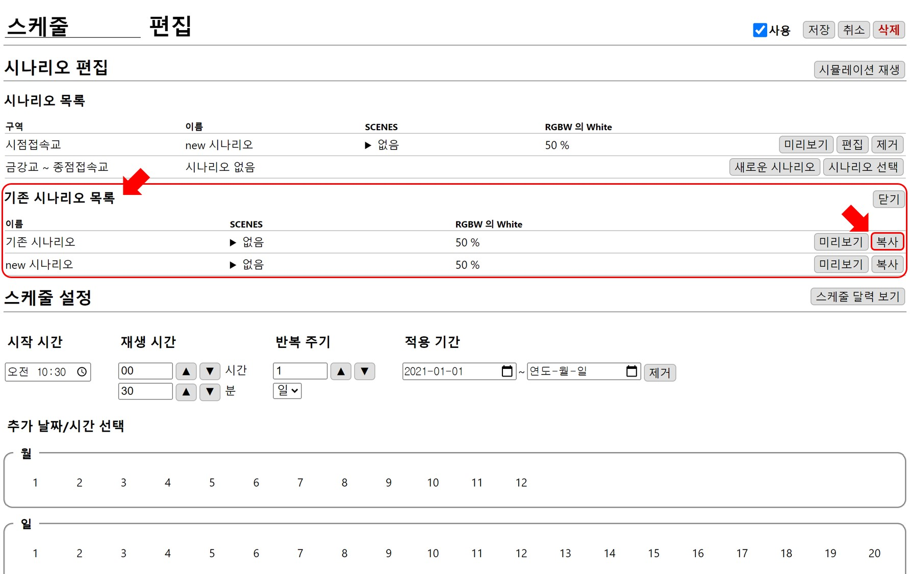
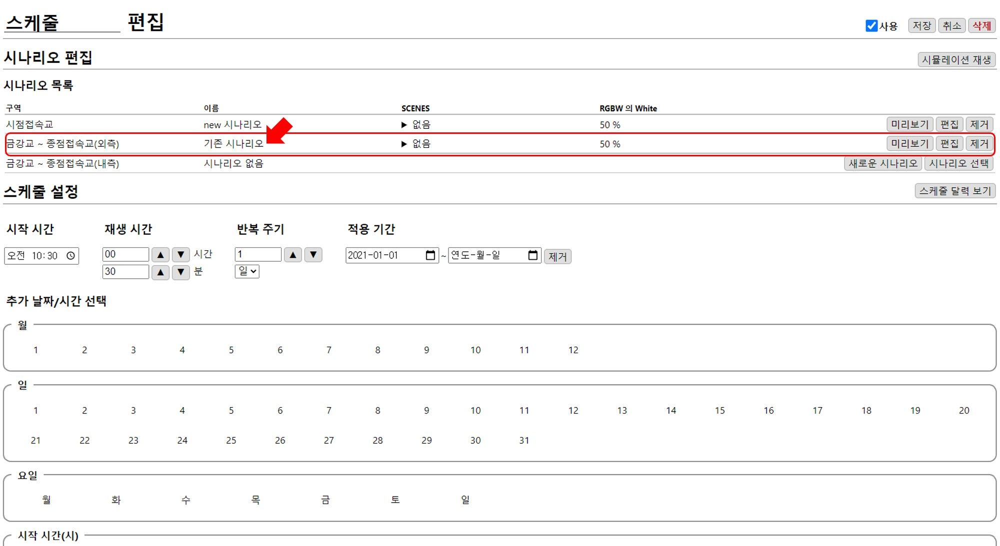
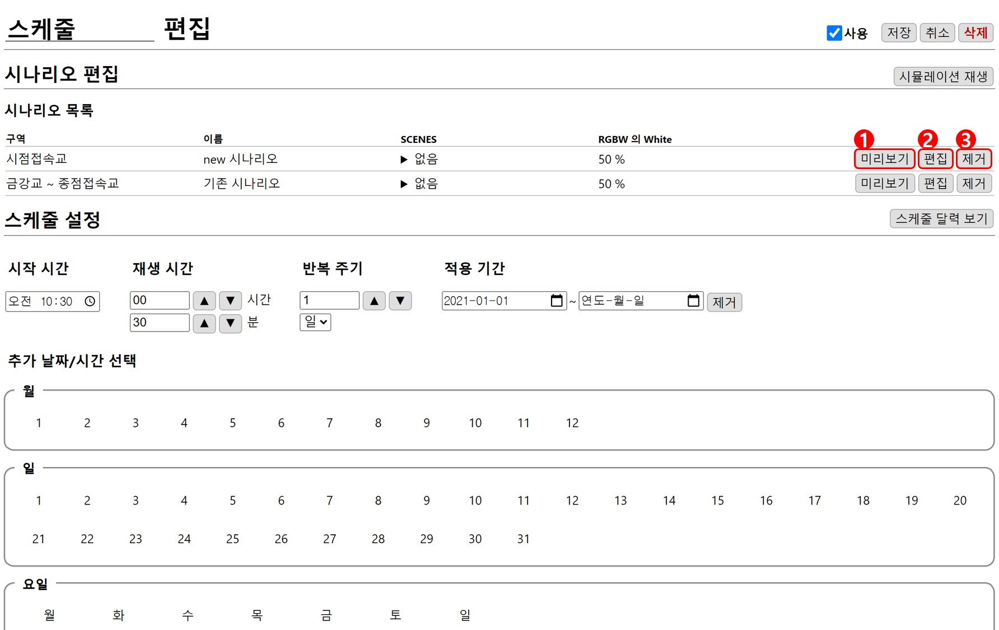
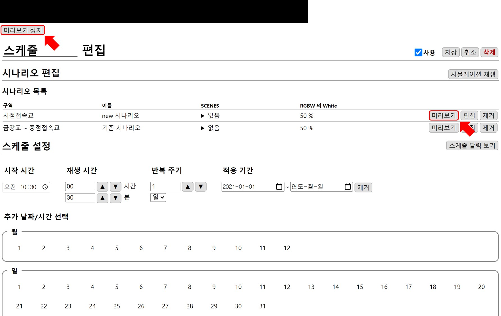
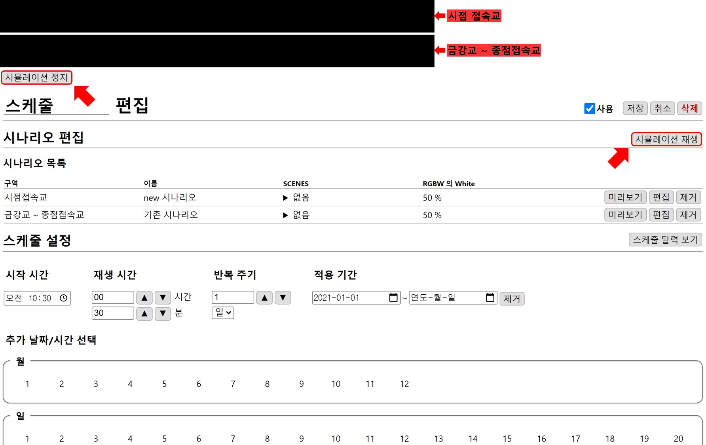

# 시나리오 편집
스케줄에 시나리오를 입력합니다. 시나리오 구역은 **시점 접속교**와 **금강교 ~ 종점접속교**로 나눠져있습니다.

## 시나리오 추가 
시나리오를 구역별로 추가합니다.

스케줄에 시나리오를 입력하는 방법은 새롭게 만들어서 추가하는 방법인 **1. 새로운 시나리오**와 기존에 만든 시나리오를 추가하는 **2. 시나리오 선택** 방법이 있습니다. 

### 1. 새로운 시나리오
`새로운 시나리오`버튼을 누르면 시나리오 편집창으로 이동합니다.

`저장`하면 스케줄의 해당 구역에 새로운 시나리오가 추가됩니다.

### 2. 시나리오 선택
`시나리오 선택`버튼을 누르면 이전에 만들었던 **기존 시나리오 목록**이 나타납니다.

추가할 시나리오를 `복사`하면 해당 구역에 시나리오가 추가됩니다.

## 편집

### 1. 미리보기
`미리 보기`를 통해 시나리오를 확인할 수 있습니다. 

`미리보기 정지` 버튼을 누르면 재생 화면이 닫힙니다.

### 2. 편집
시나리오의 편집창으로 이동합니다.

### 3. 제거
구역에서 시나리오가 제거됩니다. 연출 조명은 꺼진 상태가 됩니다.

## 시뮬레이션 재생
추가된 시나리오를 구역에 맞게 확인할 수 있습니다. `시뮬레이션 재생`를 통해 재생합니다. 

`시뮬레이션 정지` 버튼을 누르면 재생 화면이 닫힙니다.
