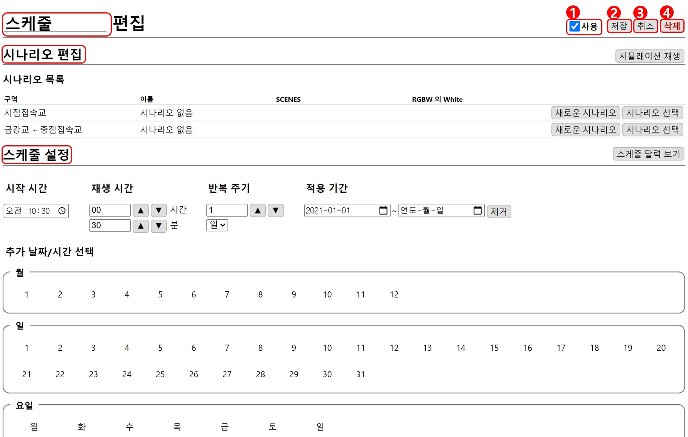

# 스케줄

## 스케줄 편집
편집창은 **현재 위치**, **시나리오 편집**, **스케줄 설정** 으로 구성되어 있습니다.

### 1. 사용
해당 스케줄의 사용 여부를 결정합니다. 체크되어 있지 않으면 스케줄 실행 시 현재 시간과 일치하는 스케줄 이여도 실행되지 않습니다.

### 2. 저장
편집된 스케줄을 저장합니다.

### 3. 취소
편집을 저장하지 않고 이전 화면으로 돌아갑니다.

### 4. 삭제
현재 편집 중인 스케줄을 삭제하고 이전 화면으로 돌아갑니다.
