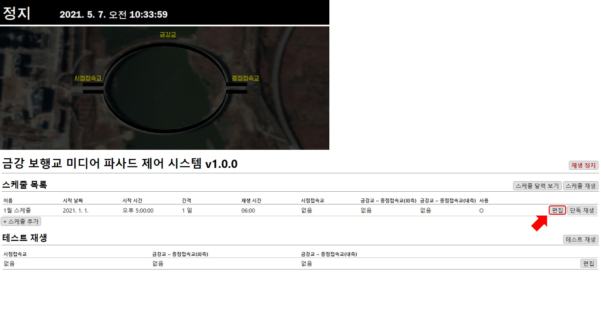
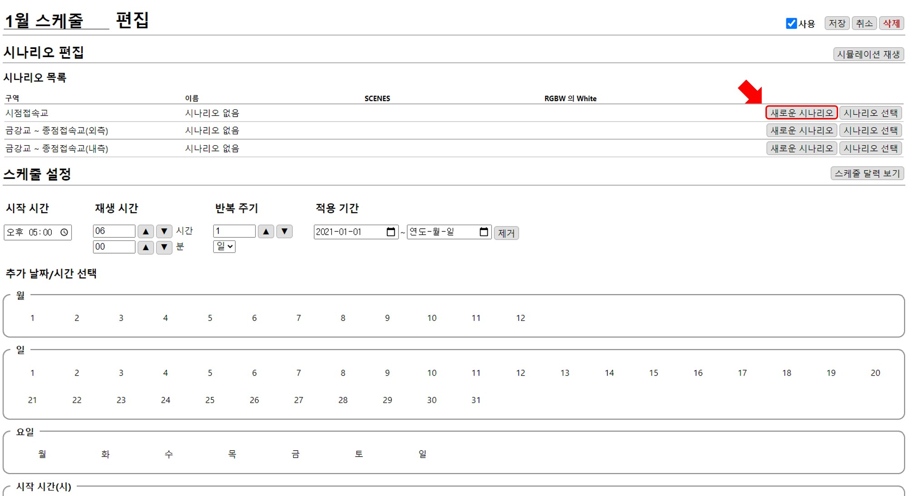
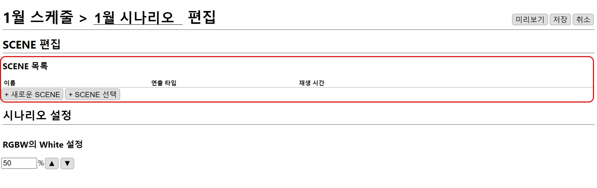

# 시점접속교 시나리오 추가
MFPlayer의 연출은 시나리오와 SCENE으로 구성되어 있습니다.
SCENE 은 MFPlayer 연출의 가장 최소 단위이고, 시나리오는 하나 이상의 SCENE으로 구성됩니다.

[스케줄 만들기](../schedule/create.md) 에서 만들어진 **1월 스케줄**의 `편집` 버튼을 누릅니다.

## 시나리오 만들기
**시점접속교**에 새로운 시나리오를 추가합니다.

## SCENE 추가
새로 만들어진 시나리오에 **이미지 흐름**과 **색상 흐름** SCENE을 만들어 추가하도록 하겠습니다.

