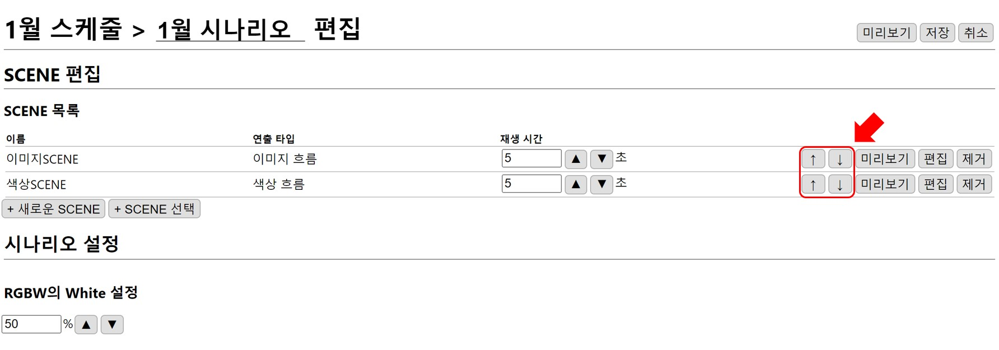
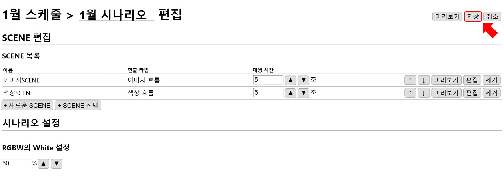

# 시나리오 설정
시나리오의 기본 재생을 설정합니다.

## 시나리오 기본 설정

### 재생 시간
SCENE의 재생 시간을  `▲` `▼` 버튼을 이용해 0.1 초 단위로 조절합니다.  
한 개 SCENE을 최소 0.5초, 최대 86400초(24시간)으로 설정할 수 있습니다.

예제에서는 기본 값을 사용하겠습니다.

### 재생 순서 
SCENE의 재생 순서는 **SCENE 목록**에 추가된 순서이고 `↑` `↓` 버튼을 이용해 변경할 수 있습니다. 

### RGBW의 White 설정
예제에서는 기본 값을 그대로 사용하고 밝기에 대한 설명은 [시나리오 설정](../../scenario/edit.md) 에서 자세하게 설명하겠습니다.  

## 시나리오 미리보기
시나리오 편집 완료 후 `미리보기` 버튼을 누르면 재생 화면이 나타나 편집 결과를 확인할 수 있습니다.
`미리보기 정지` 버튼을 누르면 재생 화면이 닫힙니다.

시나리오에 설정된 상태로 먼저 **이미지 SCENE**이 **5초**동안 재생되고 그다음 **색상 SCENE**이 **5초**동안 재생됩니다.

## 시나리오 저장
`저장` 버튼을 눌러 시나리오를 저장합니다.

**시점접속교**에 시나리오가 추가된 것을 확인할 수 있습니다.

