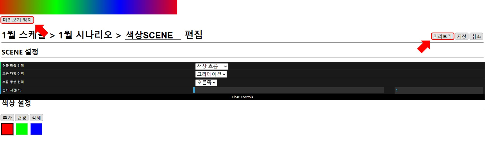

# 색상 SCENE 더하기
시나리오는 여러 SCENE 들의 모음으로 구성됩니다.
원 아이콘 오른쪽 흐름을 만들었던 시나리오에 색상 흐름 SCENE 을 더하는 방법을 통해 시나리오 기본 작성 방법을 알 수 있습니다.
시나리오는 아래의 편집 과정을 거쳐 원 아이콘이 흐르는 연출 이후에 색상 흐름 연출로 이어지는 동작을 수행하게 됩니다.

## 색상 흐름 연출
색상 흐름의 그라데이션 연출은 선택한 색상들이 점진적으로 연결되어 반복 형태로 흐르는 연출입니다.

## SCENE 추가 
이미지 SCENE이 추가된 시나리오의 편집 화면에서 `새로운 SCENE` 버튼을 누릅니다.

## SCENE 설정
[이미지 SCENE 만들기](icon.md) 와 마찬가지로
`미리보기` 버튼을 통해 반복적인 수정 - 확인 과정 이후에 `저장` 버튼을 누르면 됩니다.

### 연출 타입 선택
색상을 설정하기 위해서 `색상 흐름` 을 선택합니다.
예제에서는 `색상 흐름`으로 설정할 때 같이 설정되는 기본 값을 그대로 사용하겠습니다.
흐름 방향, 색상, 변화시간(초)에 대해서는 [색상 흐름](../../scene/gradient.md) 에서 자세하게 설명하겠습니다.  

### SCENE 미리 보기
`미리보기` 버튼을 눌러 색상 흐름 연출이 정상적으로 동작하는 것을 확인합니다.

## SCENE 저장
`저장` 버튼을 누릅니다.

시나리오에 `색상 흐름` 연출 타입의 SCENE 이 추가된 것을 확인할 수 있습니다.
SCENE 이름은 자동으로 생성되고 수정할 수 있기 때문에 예시와 다를 수 있습니다.

시나리오에 **이미지 흐름**과 **색상 흐름** SCENE을 만들어 추가하는 작업이 완료되었습니다.
