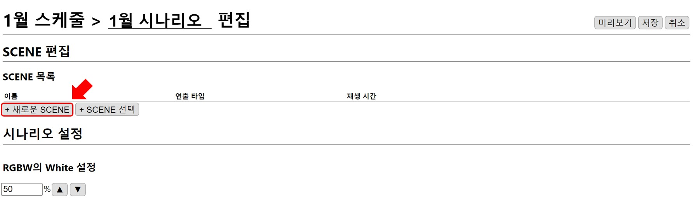
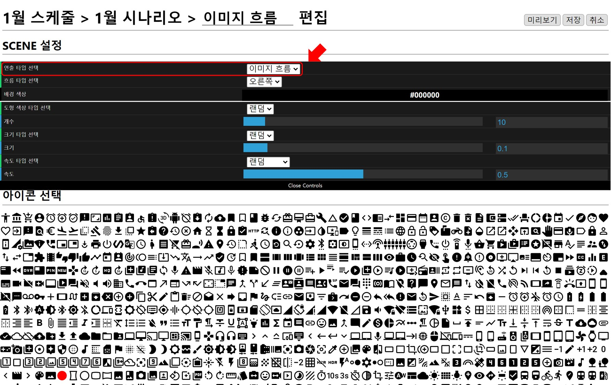
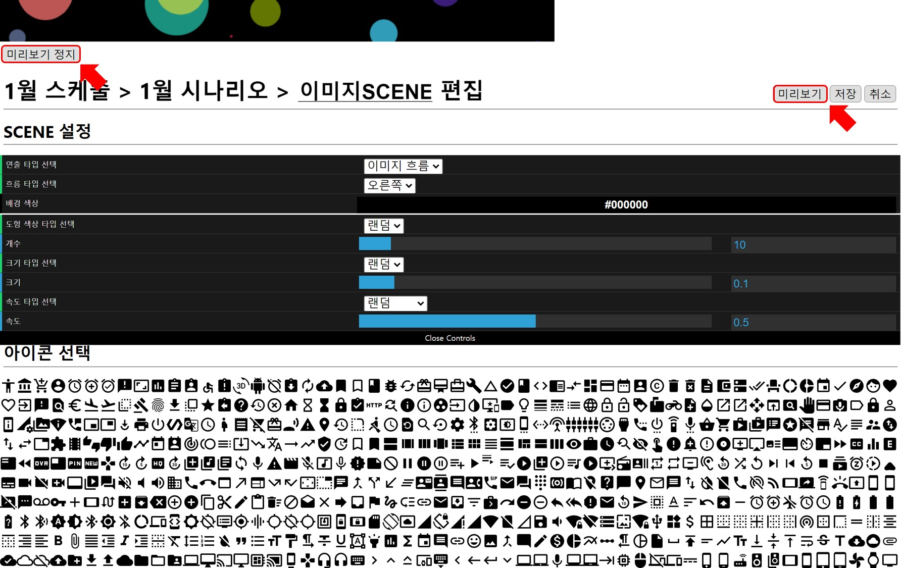
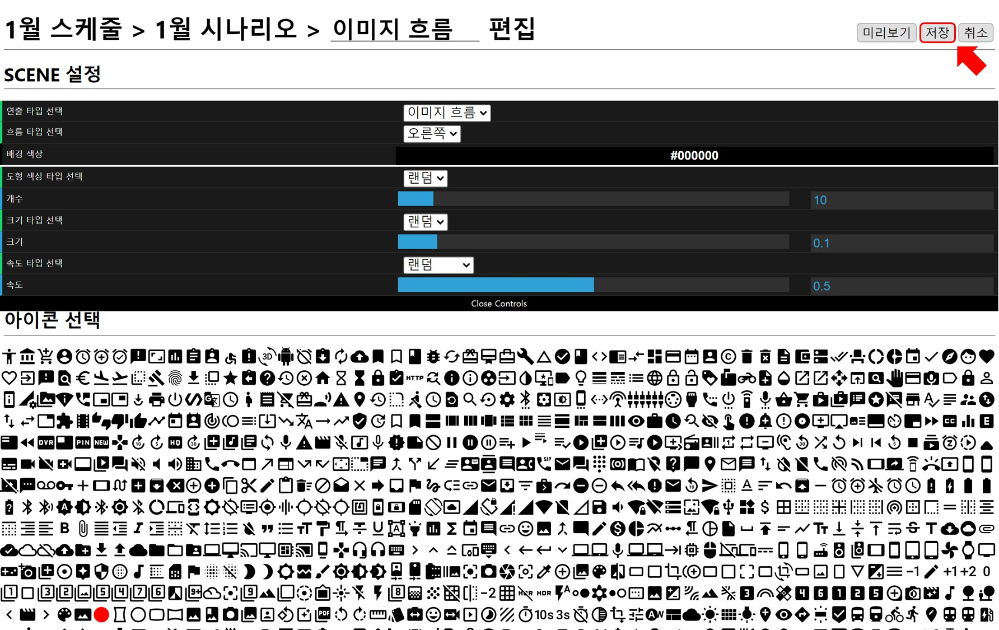
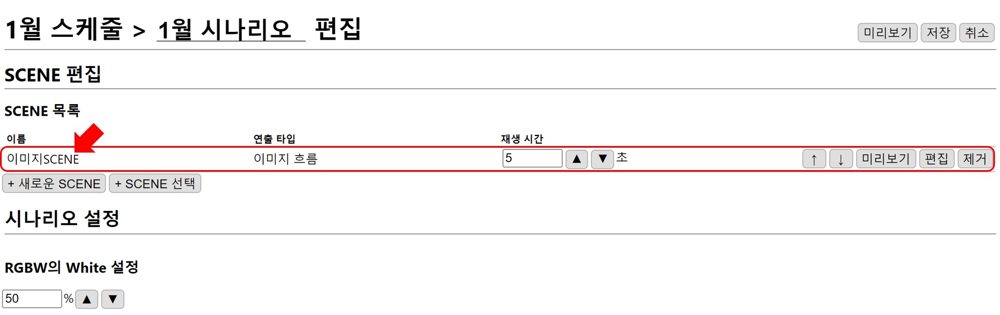

# 이미지 SCENE 만들기
시나리오의 기본 구성요소인 SCENE을 만듭니다.

## 이미지 흐름 연출
아이콘 형태의 이미지가 설정된 방향으로 흐르는 연출입니다.
예시에서는 원 아이콘이 오른쪽으로 움직이는 연출을 작성하겠습니다.

## SCENE 추가 
`새로운 SCENE` 버튼을 눌러 SCENE을 추가합니다.

## SCENE 설정
SCENE 설정 화면은 아래와 같습니다.
순서에 맞게 SCENE 연출 설정을 하고 `미리보기`로 설정 내역을 확인합니다.
설정이 완료되면, `저장` 버튼을 눌러 시나리오에 새로운 SCENE 을 추가합니다.  

### 연출 타입 선택
MFPlayer의 기본 연출 타입을 선택합니다.
**영상 파일**, **이미지 흐름**, **색상 흐름** 의 연출 타입이 있습니다.
아이콘을 설정하기 위해서 `이미지 흐름`을 선택합니다.

### SCENE 미리보기
SCENE 편집 완료 후 `미리보기` 버튼을 누르면 재생 화면이 나타나 편집 결과를 확인할 수 있고,
`미리보기 정지` 버튼으로 재생 화면을 닫을 수 있습니다.

원하는 형태의 연출이 될 때까지 **편집-미리보기** 를 통해 반복적으로 빠른 **수정-확인** 작업이 가능합니다.

## SCENE 저장
`저장` 버튼을 누르면 설정된 SCENE 저장되고 시나리오에 추가됩니다.

시나리오에 SCENE이 추가된 것을 확인할 수 있습니다.
SCENE 이름은 자동으로 생성되고 수정할 수 있기 때문에 예시와 다를 수 있습니다.

원 아이콘이 오른쪽으로 움직이는 SCENE 작성이 완료되었습니다.  

이어서 시나리오에 색상흐름 SCENE 을 더하는 방법을 설명하겠습니다.
