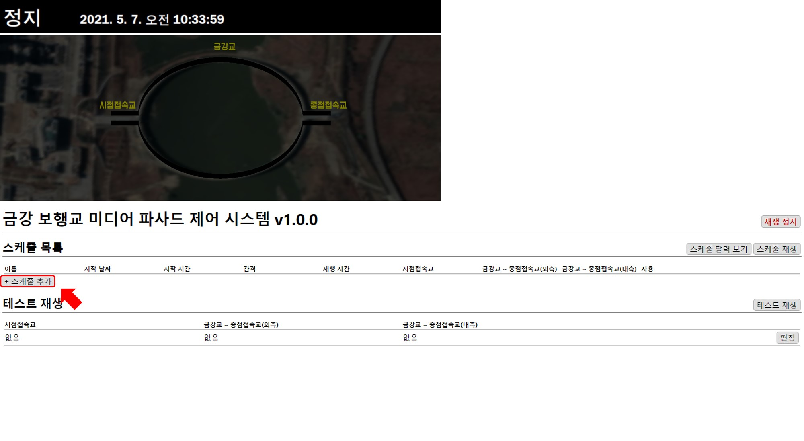
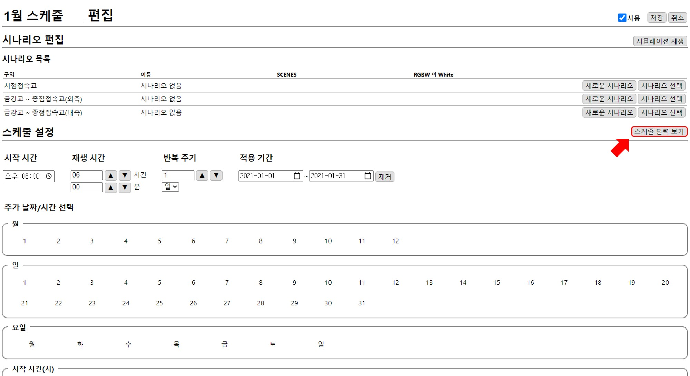

# 스케줄 만들기
새로운 연출 작성은 스케줄 만드는 것으로 시작합니다.

```
예제. 2021년 1월 동안 매일 오후 5시 ~ 11시에 재생되는 스케줄 만들기
```

## 스케줄 추가
편집 창의 홈 화면에서 `스케줄 추가` 버튼을 누릅니다.



##  스케줄 설정


### 1. 시작 시간
시작시간을 오후 5:00 으로 설정합니다.

### 2. 재생 시간
시나리오가 재생되는 시간을  `▲` `▼` 버튼을 이용해 1시간, 1분 단위로 조절 가능합니다.
오후 11:00 까지 재생하기 위해 **6시간**으로 설정합니다.

### 3. 반복 주기
주기에 맞춰 첫 시나리오부터 순서대로 재생됩니다.
반복 주기는`▲` `▼` 버튼을 이용해 숫자를 조절할 수 있고 매일 재생을 위해 **1일**로 설정합니다.

### 4. 적용 기간
1월 동안 재생하기 위해 2021-01-01 ~ 2021-01-31로 설정합니다.

### 5. 사용
사용할 스케줄이기 때문에 체크되어 있어야 합니다.

## 스케줄 달력 보기
`스케줄 달력 보기` 버튼을 누르면 현재 설정된 스케줄을 확인할 수 있습니다.

원하는 형태의 연출이 될 때까지 **편집-스케줄 달력 보기**를 통해 반복적으로 빠른 **수정-확인** 작업이 가능합니다.



매일 오후 5시에 스케줄이 실행되는 것을 확인할 수 있습니다.


## 스케줄 저장
`저장` 버튼을 눌러 스케줄을 저장합니다.


스케줄 목록에 매일 오후 5시부터 6시간 동안 실행되는 스케줄이 추가된 것을 확인할 수 있습니다.


