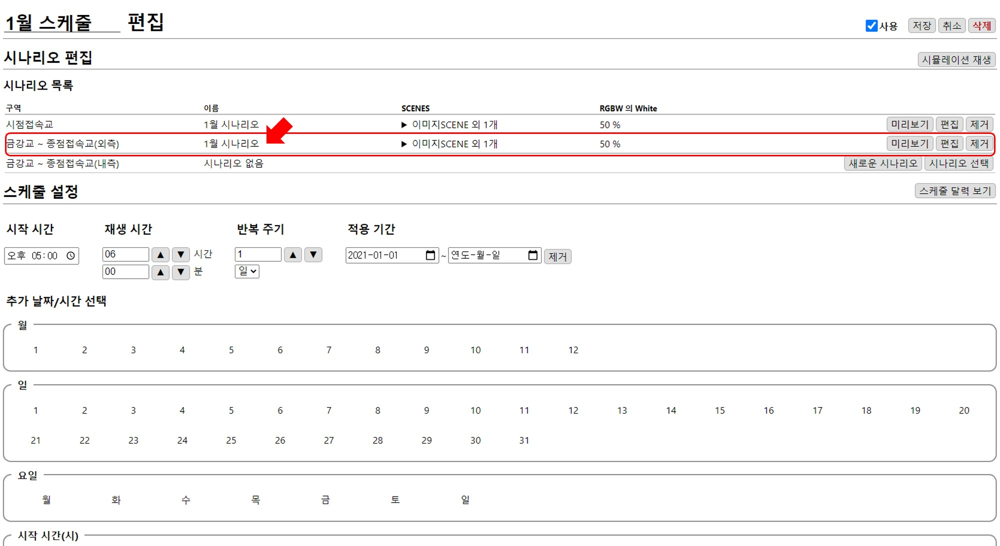
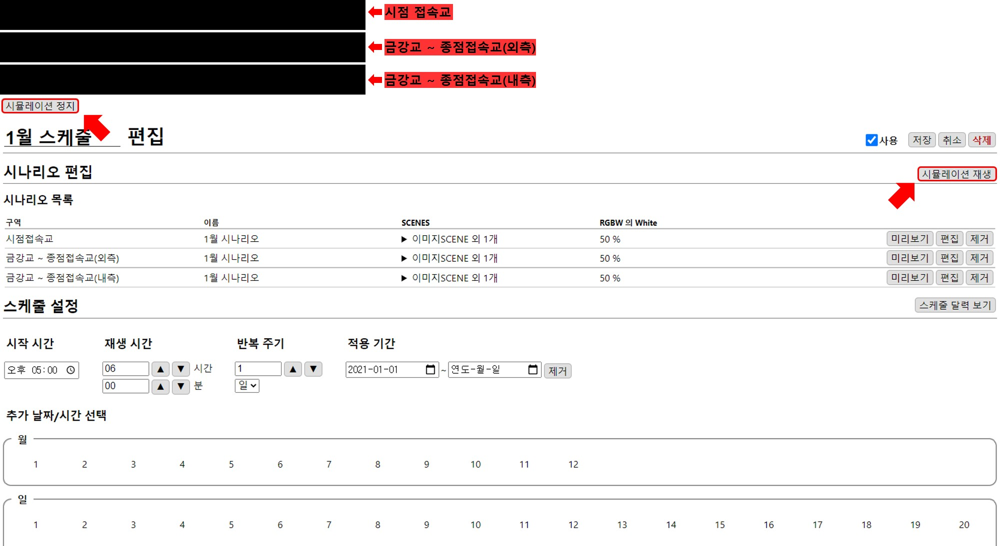
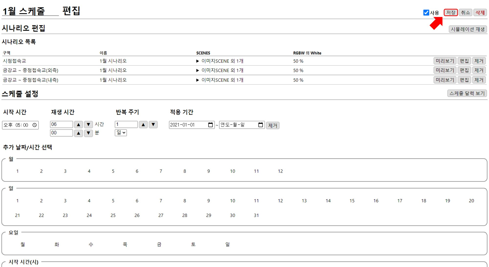
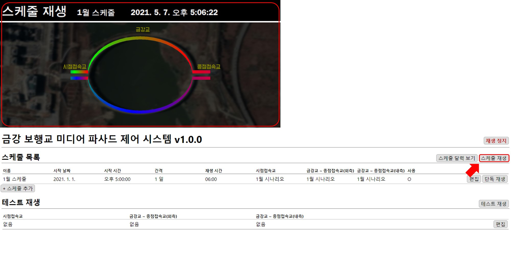

# 금강교~종점접속교 시나리오 추가
구역별로 다른 시나리오가 재생 가능하지만 예제에서는 **시점접속교**에 추가한 시나리오를 **금강교 ~ 종점접속교**에도 추가하겠습니다.

## 시나리오 추가 
앞에서 만든 시나리오를 스케줄에 추가하기 위해 `시나리오 선택`버튼을 누릅니다.

버튼을 누르면 기존에 만든 시나리오 목록이 펼쳐지고 `복사`버튼을 눌러 시나리오를 스케줄에 추가합니다.

시나리오 목록에 복사한 시나리오가 추가된 것을 확인할 수 있습니다.  

## 시뮬레이션 재생
편집 완료 후 `시뮬레이션 재생` 버튼을 누르면 재생 화면이 구역 순서대로 나타나 편집 결과를 확인할 수 있습니다.
`시뮬레이션 정지` 버튼을 누르면 재생 화면이 닫힙니다.

## 스케줄 저장
`저장` 버튼을 눌러 스케줄을 저장합니다.

만들어진 스케줄에 시나리오가 구역별로 추가된 것을 확인할 수 있습니다.

## 스케줄 재생
홈 화면의 `스케줄 재생` 버튼을 눌러 스케줄을 실행시킵니다. 실행상태는 홈 화면 상단에서 확인할 수 있습니다. 

`재생 정지`버튼을 눌러 스케줄을 정지시킬 수 있습니다.

