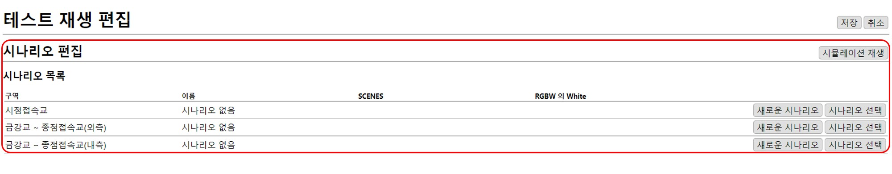

# 테스트 재생
테스트 재생은 기본적인 스케줄 없이 시나리오를 자유롭게 테스트하기 위해 기본적으로 생성되어 있고 제거할 수 없습니다.

## 테스트 재생 편집

홈 화면에서 테스트 재생 목록의 `편집`버튼을 눌러 편집 페이지로 이동합니다.

편집 화면에는 시나리오 편집만 존재하며 편집하는 방법은 스케줄 편집화면에서 시나리오를 편집하는 방법과 동일합니다.  [시나리오 편집](../schedule/scenarios.md)

